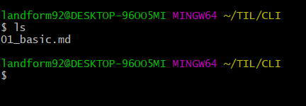

# Basic CLI

## 폴더(directory) 관련

폴더 상징 특수기호

- `~`
  - Home 폴더를 의미
  - 위치는 일반적으로 /C/Users/[계정명]
- `/`
  - Root 폴더 - 최상단을 의미
- `.`
- `..`

## 명령어

- `cd [대상폴더]`
- rm
- mkdir
- touch

```
$ mkdir TIL
$ cd TIL
$ touch 01_basic.md
```

```python
def new_func(args):
	print("hi")
```



## Summary

| commend | 설명         | 상세                  |
| ------- | ------------ | --------------------- |
| `Is`    | 목록보여주기 | `ls -a` 전체 보여주기 |
|         |              |                       |
|         |              |                       |
|         |              |                       |


