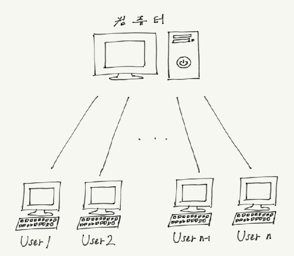

# 운영체제 역사

## 역사

### 1. No O/S 

- 1940년대 말 ( 2차대전 중 개발)

- 거대해서 한 건물안에 설치

  1. 카드리더 : 가장 큰 장치, 입력장치, 천공카드(구멍 뚫린 종이) 입력
  2. 처리기 : processer & memory
  3. 프린터 : 출력장치, output을 line print

- 동작 순서 : card reader -> memory -> proessing -> printer

  1. 프로그램을 천공카드에 표시해 메모리에 적재

  2. 컴파일러를 천공카드에 표시해 메모리에 적재

  3. 컴파일러가 프로그램 번역 -> 기계어

  4. 처리기가 기계어 실행 -> 출력

     

### 2. Batch processing system (일괄처리) - 최초의 O/S

- 프로그램을 수행할 때마다 컴파일->링크->로딩 순서를 오퍼레이터가 직접 입력함

  => 이러한 과정을 하나의 프로그램으로 작성해 메모리에 안에 할당해 자동화한 것이 batch processing

- resident monitor : 메모리에 상주하며 일련의 일(컴파일, 링크, 로딩 등)을 하는 프로그램

### 3. Multiprogramming system (다중 프로그래밍)

- 1960년대

- 하드웨어의 발달

  1. 메인 메모리 외에도 하드디스크 생산
  2. 메인 메모리 커짐(진공관에서 발전)
  3.  프로세스 속도 빨라짐

- 메모리에서 유저 프로그램 동작 시

  1. CPU는 빠르게 동작하나 I/O가 느림
  2. I/O실행 중 CPU idle (idle : 어떠한 프로그램에서도 사용되지 않는 상태)

- 메모리에 여러개의 프로그램을 올려 작업을 실행 (job1, job2, job3 ...)

  - CPU 유휴 시 다른 프로그램의 연산 작업 수행

    => Multiprogramming system

- 고려사항
	- 프로그램 동작 순서를 정하는 CPU scheduling 중요
	- 메모리 내에서 유저프로그램의 위치 중요
	- 다른 영역의 프로그램 침범을 막기위한 보호 중요

### 4. Time-sharing system (시공유 시스템)

- 1960년대 말 Unix가 대표적
- 모니터, 키보드의 개발 => interactive system의 구현
- 컴퓨터의 가격이 비쌈 => 컴퓨터 한대에 여러대의 단말기(terminal) 연결 
  - 단말기 : 모니터, 키보드만 존재

- CPU가 아주 빠르게 프로그램을 스위칭하며 동작 (Time-sharing)
- 새로운 기술의 발전
  - 유저간 통신 가능해짐
  - 동기화 : 동시에 실행 되므로 프로그램 실행 순서를 정하는 것
  - 가상메모리 : 유저가 많아지면 메인 메모리부족 => 하드디스크의 일부를 메인 메모리처럼 사용하는 기술 등장

## OS기술 천이

### 1.  컴퓨터 규모별 분류

- 1970, 1980 년대

  Supercomputer => Mainframe(단말기 수백대) => Mini(단말기 수십대) => Micro

- 현재

  Supercomputer => Server => Workstation => PC => Handheld => Embedded

  

### 2. 고성능 컴퓨터의 O/S기술이 handheld/embeded까지 발전

- Batch processing
- Multiprogramming
- Time-sharing (📌이번 수업 때 중점적으로 배울 것)

### 3. 고등 운영 체제의 등장

- 추후 배울 예정

