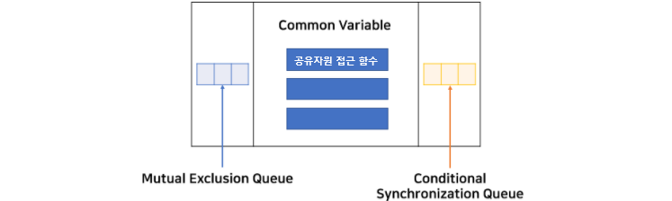

# 모니터

> 경성대학교 양희재 교수님의 강의 자료를 정리한 것입니다.

## 1. 모니터의 구조

- 세마포보다 고수준의 동기화 도구이다.

- 공유자원 + 공유자원 접근함수 + 2개의 큐로 이루어져 있다.

- 2개의 큐는 mutual exclusion queue(배타동기) 와 conditional synchronization queue(조건동기) 이다.

  


## 2. 자바 모니터

자바에서는 모든 객체가 모니터가 될 수 있다.

- 배타동기: `synchronization` 키워드를 사용하여 지정  =>  한 쓰레드에만 접근이 가능하다.

- 조건동기: `wait(), notify(), notifyAll()` 메소드를 사용

  

1. 공유자원 접근함수에는 최대 1개 쓰레드만 접근 가능하므로 나머지는 배타동기 큐에서 대기
2. 진입된 쓰레드는 `wait()`에 의해 조건동기 큐에 블록될 수 있다.
3. 새 쓰레드 진입 가능
4. 새 쓰레드는 `notify()`로 블록된 쓰레드를 깨울 수 있다.
5. 깨워진 쓰레드는 현재 쓰레드가 나가면 재진입 가능


### 2-1 은행계좌  문제

#### 2-1-1 Mutual Exclusion

```java
class Test {
	public static void main(String[] args)
	throws InterruptedException {
		BankAccount b = new
		BankAccount();
		Parent p = new Parent(b);
		Child c = new Child(b);
		p.start();
		c.start();
		p.join();
		c.join();
		System.out.println( "\nbalance = " + b.getBalance());
	}
}
//============================================================================
class BankAccount {
	int balance;
	synchronized void deposit(int amt) { // synchronized를 이용해 상호배타 선언
		int temp = balance + amt;
		System.out.print("+");
		balance = temp;
	}
	synchronized void withdraw(int amt) { // synchronized를 이용해 상호배타 선언
		int temp = balance - amt;
		System.out.print("-");
		balance = temp;
	}
	int getBalance() {
		return balance;
	}
}
//=============================================================================
class Parent extends Thread {
	BankAccount b;
	Parent(BankAccount b) {
		this.b = b;
	}
	public void run() {
		for (int i=0; i<100; i++)
			b.deposit(1000);
	}
}

class Child extends Thread {
	BankAccount b;
	Child(BankAccount b) {
		this.b = b;
	}
	public void run() {
		for (int i=0; i<100; i++)
			b.withdraw(1000);
	}
}
```

```
+++++++++++++++++++++++------------------------------------------+++++++++++++++
++++++++++++++++++++++++++++++++++++++++++++++++++++++++++++++------------------
----------------------------------------
balance = 0
```


#### 2-1-2 Ordeing

입금먼저 수행

```java
class BankAccount {
	int balance;
	synchronized void deposit(int amt) {
		int temp = balance + amt;
		System.out.print("+");
		balance = temp;
		notify();  // wait()를 깨워줌
	}
	synchronized void withdraw(int amt) {
		while (balance <= 0)  // 먼저 시작시 (잔액 <= 0)
			try {
				wait();  // 조건동기 큐에 블록
			} catch (InterruptedException e) {}  
                      // wait()가 무한히 대기할 경우를 대비해 인터럽티브익셉션을 발생
		int temp = balance - amt;
		System.out.print("-");
		balance = temp;
	}
	int getBalance() {
		return balance;
	}
}
```

```
++++++++++++++++++++++++++++++++++++++++++++++++++++++++++++++++++++++++++++++++
++++++++++++++++++++------------------------------------------------------------
----------------------------------------
balance = 0
```


출금먼저 수행

```java
// 반대로
class BankAccount {
	int balance;
	synchronized void deposit(int amt) {
		while (balance == 0)
			try {
				wait();
			} catch (InterruptedException e) {}
		int temp = balance + amt;
		System.out.print("+");
		balance = temp;
	}
	synchronized void withdraw(int amt) {
		int temp = balance - amt;
		System.out.print("-");
		balance = temp;
		notify();
	}
	int getBalance() {
		return balance;
	}
}
```

```
--------------------------------------------------------------------------------
--------------------++++++++++++++++++++++++++++++++++++++++++++++++++++++++++++
++++++++++++++++++++++++++++++++++++++++
balance = 0
```


번갈아가며 수행

```java
class BankAccount {
	int balance;
	boolean p_turn = true;  // p_turn parent의 차례라는 뜻, 부모 먼저해라
	synchronized void deposit(int amt) {
		int temp = balance + amt;
		System.out.print("+");
		balance = temp;
		notify(); // 자식을 깨움
		p_turn = false;  // 부모 턴 지남
		try {
			wait();  // 블록
		} catch (InterruptedException e) {}
	}
	synchronized void withdraw(int amt) {
		while (p_turn)  // p_turn이 먼저인 동안 기다림
			try {
				wait(); 
			} catch (InterruptedException e) {}
		int temp = balance - amt;
		System.out.print("-");
		balance = temp;
		notify();  // 부모 깨움
		p_turn = true;  //  부모 턴
	}
	int getBalance() {
		return balance;
	}
}
```

```
+-+-+-+-+-+-+-+-+-+-+-+-+-+-+-+-+-+-+-+-+-+-+-+-+-+-+-+-+-+-+-+-+-+-+-+-+-+-+-+-
+-+-+-+-+-+-+-+-+-+-+-+-+-+-+-+-+-+-+-+-+-+-+-+-+-+-+-+-+-+-+-+-+-+-+-+-+-+-+-+-
+-+-+-+-+-+-+-+-+-+-+-+-+-+-+-+-+-+-+-+-
balance = 0
```


### 2-2 전통적인 동기화 문제

#### 2-2-1 Producer-Consumer Problem

```java
class Buffer {
    int[] buf;
    int size, count, in, out;
    Buffer(int size) {
        buf = new int[size];
        this.size = size;
        count = in = out = 0;
    }
// 세마포보다 한결 수월하게 해결 가능
//======================================================================
    synchronized void insert(int item) {
        while (count == size)
            try {
                wait();
            } catch (InterruptedException e) {}
        buf[in] = item;
        in = (in+1)%size;
        notify();
        count++;
    }

    synchronized int remove() {
        while (count == 0)
            try {
                wait();
            } catch (InterruptedException e) {}
        int item = buf[out];
        out = (out+1)%size;
        count--;
        notify();
        return item;
    }
}
//======================================================================

class Producer extends Thread {
    Buffer b;
    int N;
    Producer(Buffer b, int N) {
        this.b = b; this.N = N;
    }
    public void run() {
        for (int i=0; i<N; i++)
            b.insert(i);
    }
}

class Consumer extends Thread {
    Buffer b;
    int N;
    Consumer(Buffer b, int N) {
        this.b = b; this.N = N;
    }
    public void run() {
        int item;
        for (int i=0; i<N; i++)
            item = b.remove();
    }
}

class Test {
    public static void main(String[] arg) {
        Buffer b = new Buffer(100);
        Producer p = new Producer(b, 10000);
        Consumer c = new Consumer(b, 10000);
        p.start();
        c.start();
        try {
            p.join();
            c.join();
        } catch (InterruptedException e) {}
        System.out.println("Number of items in the buf is " + b.count);
    }
}
```

```
Number of items in the buf is 0
```


#### 2-2-2 The Dining Philosopher Problem

```java
class Philosopher extends Thread {
    int id; // philosopher id
	Chopstick lstick, rstick;
    Philosopher(int id, Chopstick lstick, Chopstick rstick) {
        this.id = id;
        this.lstick = lstick;
        this.rstick = rstick;
    }

    public void run() {
        try {
            while (true) {
                lstick.acquire();
                rstick.acquire();
                eating();
                lstick.release();
                rstick.release();
                thinking();
            }
        }catch (InterruptedException e) { }
    }

    void eating() {
        System.out.println("[" + id + "] eating");
    }
    void thinking() {
        System.out.println("[" + id + "] thinking");
    }
}

//======================================================================
class Chopstick {
    private boolean inUse = false;  // 처음엔 아무도 사용 안하므로 false
    synchronized void acquire() throws InterruptedException {
        while (inUse)  // 이미 남이 사용 중이면 대기
            wait();
        inUse = true;  // 사용하면 true
    }
    synchronized void release() {
        // 젓가락 놓으면 false
        inUse = false;
        notify();  // 혹시 큐에 젓가락 사용 대기중인 사람 있으면 깨워줌
    }
}
//======================================================================

class Test {
    static final int num = 5; // number of philosphers & chopsticks
    public static void main(String[] args) {
        int i;
        /* chopsticks */
        Chopstick[] stick = new Chopstick[num];
        for (i=0; i<num; i++)
            stick[i] = new Chopstick();
        /* philosophers */
        Philosopher[] phil = new Philosopher[num];
        for (i=0; i<num; i++)
            phil[i] = new Philosopher(i, stick[i], stick[(i+1)%num]);
        /* let philosophers eat and think */
        for (i=0; i<num; i++)
            phil[i].start();
    }
}
```

데드락을 해결하지 않은 코드라서 일정 시간 실행되다가 블락됨

이를 해결하기 위해선 어느 한 곳의 오른쪽, 왼쪽 젓가락 집는 순서를 바꾸어서 원형구조가 만들어 지지 않도록 한다.


