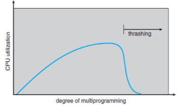
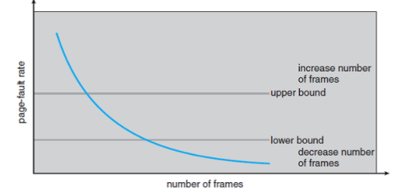

# 프레임 할당

> 경성대학교 양희재 교수님의 강의 자료를 정리한 것입니다.

## 쓰레싱(Thrashing)

메모리에 올라가는 프로세스 수가 많아질수록 CPU 이용률이 증가할 것 같지만 일정 수준을 넘어서면 오히려 감소하는 현상

원인 : 페이지가 메인 메모리에 가득차서 빈번한 page in/out이 발생하고 I/O 작업중에는 CPU를 사용하지 않아서 감소함

해결방법 : 

- Local Replacement 사용 -> 메모리 사용 효율이 감소하는 단점
- 프로세스당 충분한/적절한 수의 프레임 할당

> Global Replacement: 메모리 상의 모든 프로세스 페이지에 대한 교체 작업을 수행한다.
>
> Local Replacement: 메모리 상의 자기 자신의 프로세스 페이지에 대해서만 교체 작업을 수행한다.
>
> 메모리 사용 효율은 일반적으로 Global Replacement가 좋다.

## 프레임 할당

1. 정적할당

   - 동일할당 : 모든 프로세스에 동일한 비율로 할당
   - 비례할당 : 용량이 클수록 비례하게 할당

  

2. 동적할당

   - Working Set Model

     > Locality : 프로세스를 실행 중일때 어떤 번지의 주소를 참조하는지를 조사한 것

     따라서 각각의 시간에 Locality를 포함하는 프레임을 할당해 주면 적절하게 메모리와 CPU를 쓸것이다.

     BUT, 실제로 사용하기에는 미래를 알아야 가능함

     

     그래서 Working set 방식을 사용

     > Working set window(=Δ) : 현 시점을 기준으로 얼마를 과거로 보는지에 대한 시간(OS를 만든사람이 결정)

     Working set은 과거에 어떤 페이지가 사용되어 왔는지에 대한 데이터이고 Working set window시간만큼 과거의 페이지를 참조해 페이지를 할당해줌

     

   - Page-Fault Frequency(PFF)

     Page fault인 페이지의 결함 발생 비율을 측정해서 프레임 할당

     

     상한선(upper bound) 초과 프로세스에 더 많은 프레임 할당

     하한선(lower bound) 이하 프로세스의 프레임은 회수

  

## 페이지 크기

현재 일반적인 크기는 4KB ~ 4MB 이고 하나의 프로세스 크기들이 커지고 있기 때문에 점차 커지는 경향이 있다.

### 페이지 크기 영향

- 내부단편화 : 내부단편화를 줄이려면 페이지 크기는 작은 것이 좋다.

- Page-in, page-out 시간 : 하드디스크 기준으로 헤더가 움직이는 시간이 가장 큰 요인이고 이를 seek time 이라 한다.

  페이지 크기가 크면 클수록 한 번의 seek time마다 큰 페이지를 읽을 수 있으므로, 페이지 부재 빈도가 줄어든다.(데이터를 읽는 시간은 크기에 따라 차이가 매우 적다.)

- 페이지 테이블 크기 : 페이지 크기가 클수록 페이지 개수가 줄어들기 때문에 그만큼 페이지 테이블 크기도 줄일 수 있다.

- Memory resolution(해상도) : Memory resolution은 해당 메모리에 필요한 데이터가 있는 확률이다. 이는 페이지 크기가 작을수록 resolution을 높일 수 있다. 만약 페이지 크기가 크면 다른 필요없는 부분이 있을 확률이 크기 때문이다.

- Page fault 발생 확률 : Page fault 발생 확률을 줄이려면 페이지 크기가 큰 것이 좋다. 이는 locality 성질과도 관련이 있는데, 대부분 프로세스는 필요한 부분이 일정 범위 이내인 경우가 많으므로 페이지 크기가 클수록 필요한 부분이 있을 확률이 크다.

#### 정리

| 페이지 크기에 영향을 받는 것 | 페이지의 크기 |
| ---------------------------- | ------------- |
| 내부 단편화                  | 작을수록 좋음 |
| Page-in, Page-out 시간       | 클수록 좋음   |
| 페이지 테이블 크기           | 클수록 좋음   |
| Memory resolution            | 작을수록 좋음 |
| Page fault                   | 클수록 좋음   |