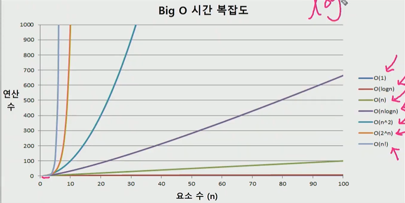
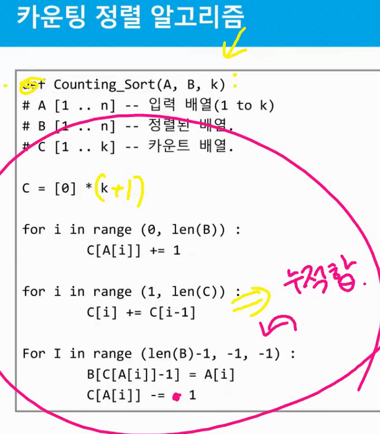

시간복잡도 계산

빅오 표기법 <= 최악의 경우 고려

- 최고차항을 고르고 지수제거한 것

- 

## 정렬

### 버블정렬

인접한 두 개의 원소를 비교하며 자리를 계속 교환하는 방식

O(n^2)

### 카운팅 정렬

집합에 각 항목이 몇 개씩 있는지 세는 작업을 하여 선형시간에 정렬하는 효율적인 알고리즘

제한사항 : 정수나 정수로 표현할 수 있는 자료에 대해서만 가능, 카운트들을 위한 충분한 공간을 할당하려면 집합 내 가장 큰 정수를 알아야함

O(n+k) : n은 리스트의 길이, k는 정수의 최대값

동일한 값이 있을때 그 순서를 지키기 위해서 뒤에서 부터 정렬함 => 안정정렬

최대값이 적당히 적은 값일때 사용해야 효율적이다! ex) 1000명 학생의 점수가 0~100사이

## 완전검색

문제의 해법으로 생각할 수 있는 모든 경우의 수를 나열해보고 확인하는 기법

일반적으로 경우의 수가 상대적으로 작을 때 유용

자격검정평가 등에서 주어진 문제를 풀 때 우선 완전검색으로 해답을 도출한 후 성능개선을 위해 다른 알고리즘을 사용하는 것이 바람직

## 순열

서로 다른 것들 중 몇개를 뽑아서 한줄로 나열하는 것

## 탐욕 알고리즘

최적해를 구하는 근시안적인 방법

하나를 선택할때 마다 최적이라고 생각되는 것을 선택해 진행해 최종 해답에 도달

최종 해답이 꼭 최적이라는 보장은 없다

일반적으로 머릿속에 떠오르는 생각을 검증없이 바로 구현하면  Greedy 접근이 된다.

