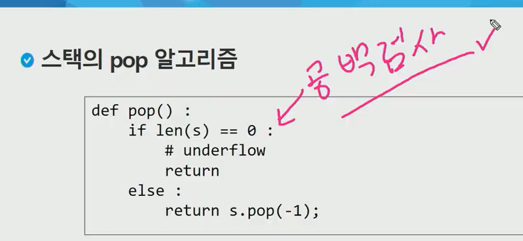
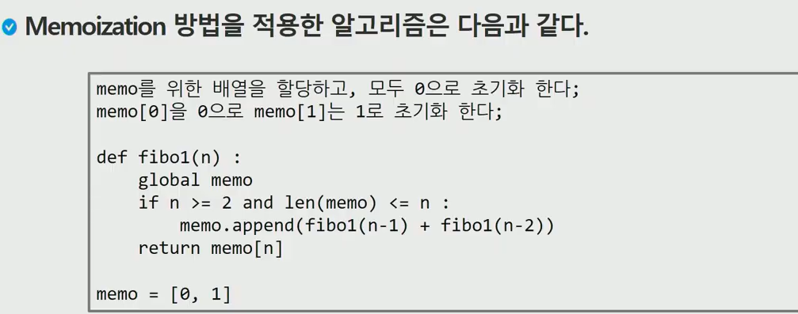
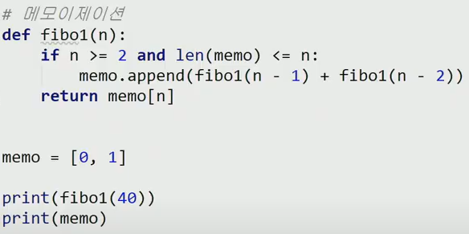
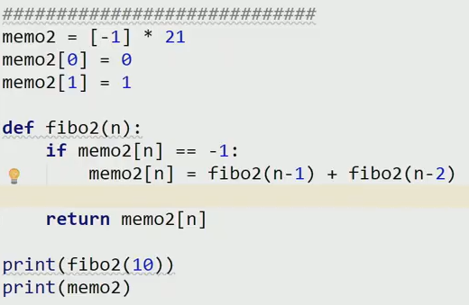

스택에 저장된 자료는 선형구조를 가짐

- 선형구조 : 자료간의 관계가 1대 1

- 비선형구조 : 자료간의 관계까 1 대 N (ex:트리)

후입선출 (LIFO)

스택의 구현

리스트를 사용

마지막 삽인된 원소의 위치를 top이라 부름

삽입 : push

삭제 : pop

공백인지 확인: isEmpty

top에 있는 원소를 값만 확인하는 것 : peek

스택의 응용1 : 괄호검사

1. 왼쪽괄호의 갯수와 오른쪽 괄호의 갯수는 같아야 한다
2. 같은 괄호에서 왼쪽 괄호는 오른쪽 괄호보다 먼저 나와야 한다.
3. 괄호사이에는 포함관계가 성립한다.

memoization

피보나치수열을 재귀를 통해 구현한 경우 중복이 많이 발생함 이를 해결해보자

이전에 계산한 값을 메모리에 저장해서 전제적인 실행속도를 빠르게 할 수 있다. 동적계획법(Dynamic Prograomming)의 핵심기술

DFS (깊이우선탐색)

