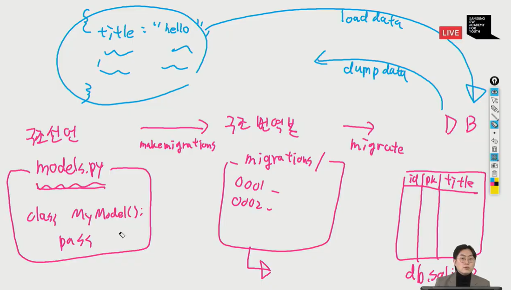

movies.movie의 데이터를 movies.json에 저장하기  (앱이름.모델이름(모델이름 소문자로))

indent 4는 4칸씩 들여쓰기 해라는 뜻

- python manage.py dumpdata --indent 4 movies.movie > movies.json

movies.json파일을 fixtures/movies에 저장

데이터를 내 데이터베이스에 저장

- python manage.py loaddata movies/movies.json

데이터 베이스 자체를 공유하면 저장 시간 등에 따라 내부 코드가 조금씩 바뀌므로 db파일은 git으로 관리 안함! -> 데이터 파일을 따라로 dumpdata로 만들어 공유

