# 설치

sqlite 홈페이지에 다운로드에서 파일 2개 받음

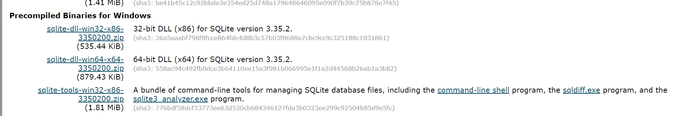

C:\sqlite 폴더 생성 후 저장

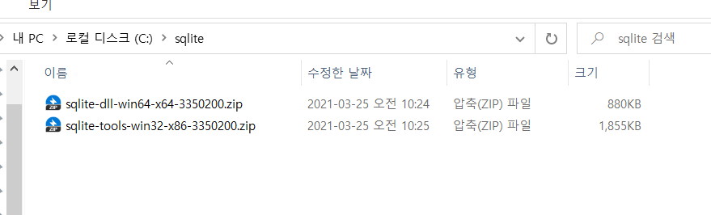

안의 파일 끄집어내기

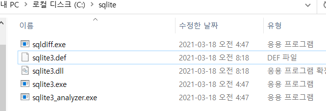

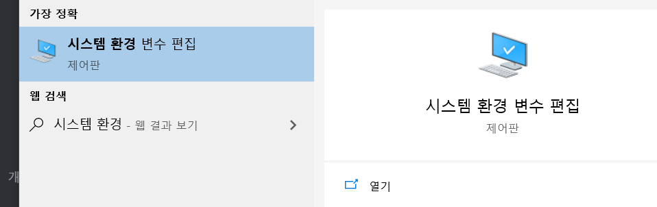

환경변수에 시스템변수에 path 더블클릭 후 경로 추가

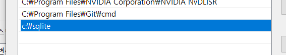

## 사용하기

사용가능~✨

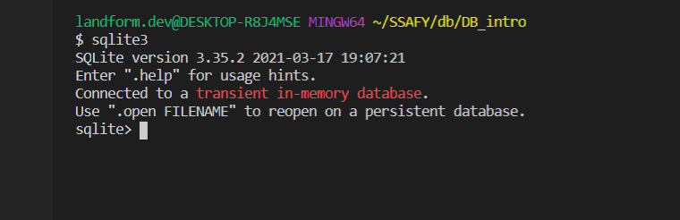

종료는 ctrl + z 엔터

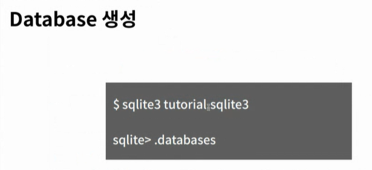

;로 데이터베이스 생성

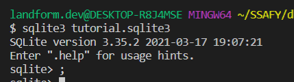

csv사용 가능하게 모드 변경

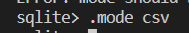

파일을 테이블에 넣기 (example이 테이블 이름)

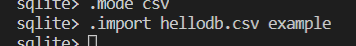

테이블 삭제 (그냥 DROP TABLE도 가능)

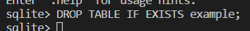

테이블 내의 모든 값 가져오기

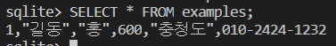

테이블 생성

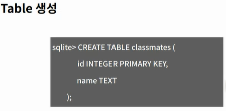

sqlite자체에선 명령어의 수정이 귀찮으니 파일 하나 만들고 읽어오는 식으로 진행

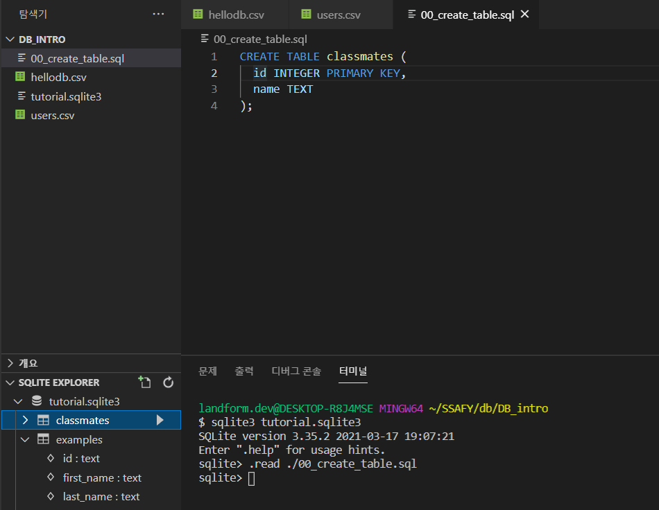

dbshell 구문을 이용해 django에서 db만지는 것 가능

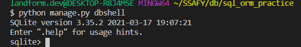

shell_plus에서 코드 작성시 sql문을 보여줌

- python manage.py shell_plus --print-sql