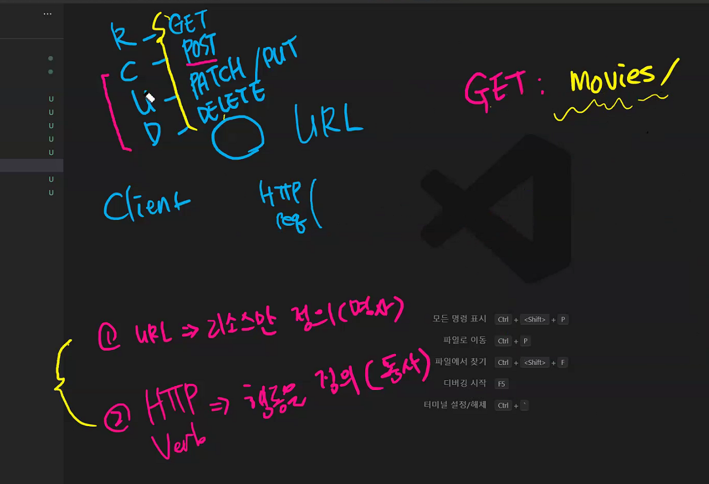
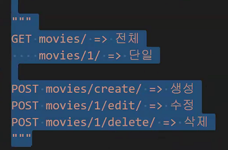
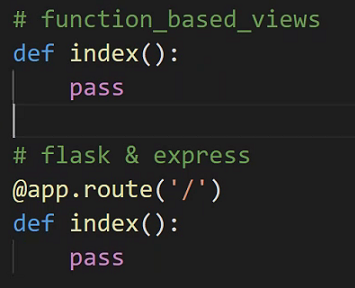
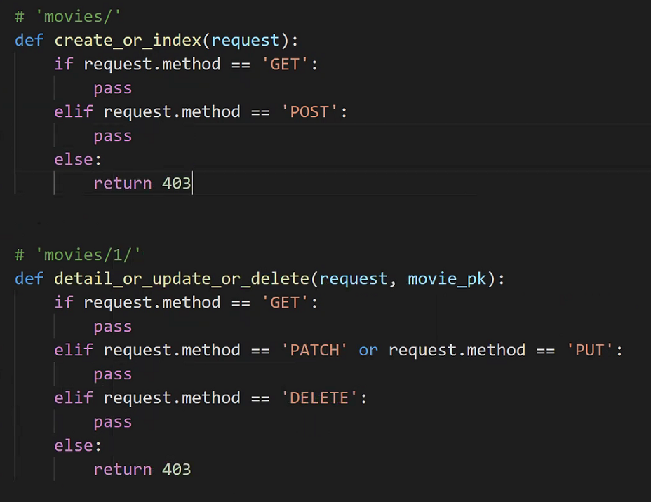
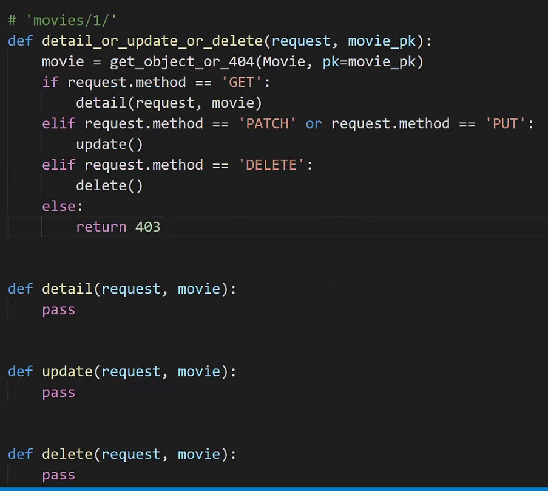
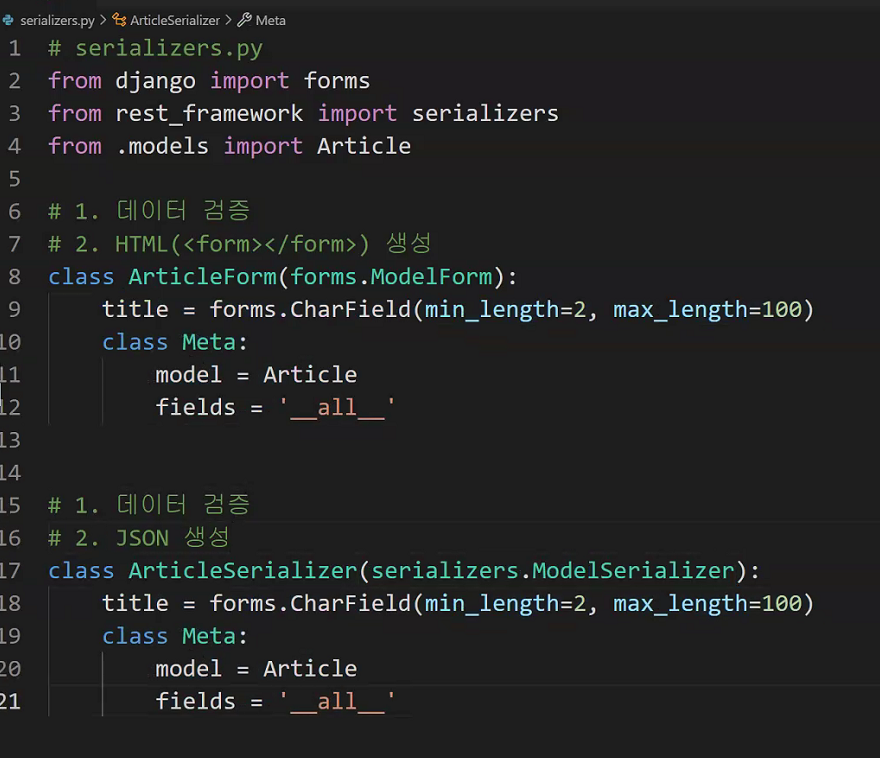
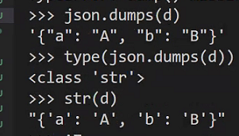
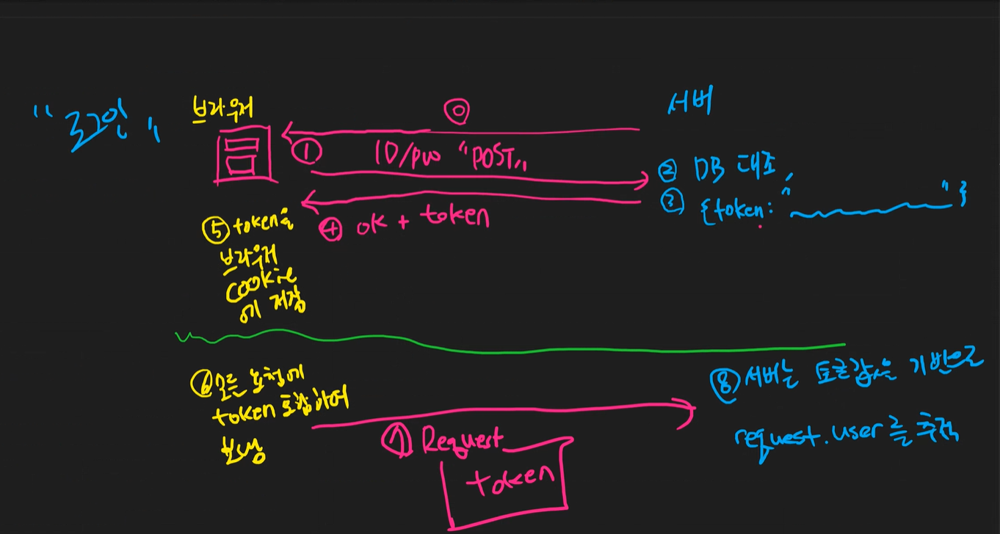

기존 CRUD -> restful 하지 않음

깔끔하지 않다. (restful하지 않다)

json은 반드시 큰따옴표로 구성되어야 한다!

drf의 존재이유는 serializer!

json

1. K - V
2. 스트링으로 해석가능하다

authenication logic

# 클래스형 뷰 (CBV, Class-Based View)

클래스형 뷰는 상속과 믹스인 기능을 이용하여 코드 재사용하고 뷰를 체계적으로 구성할 수 있다.

## CBV의 장점

- GET, POST 등 HTTP 메소드에 따른 처리 코드를 작성할 때 if 함수 대신에 메소드 명으로 코드의 구조가 깔끔하다.
- 다중상속 같은 객체지향 기법을 활용해 제너릭 뷰, 믹스인 클래스 등을 사용해 코드의 재사용과 개발 생산성을 높여준다.