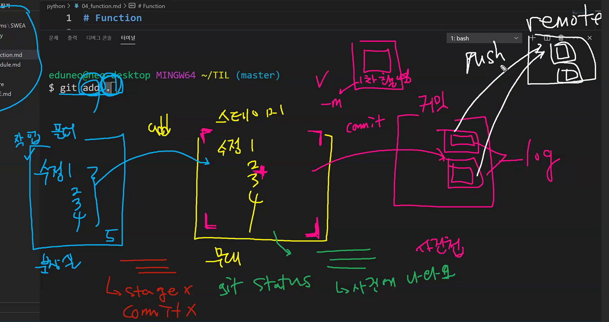
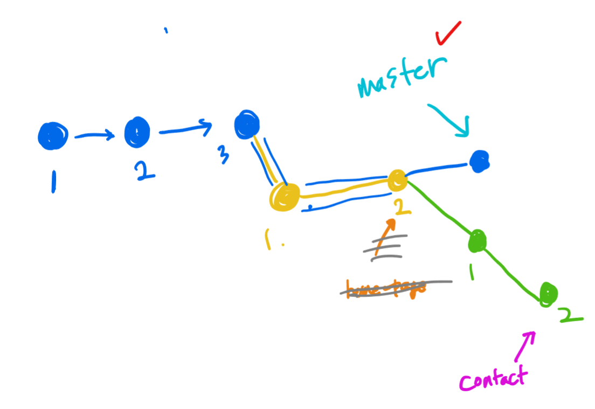
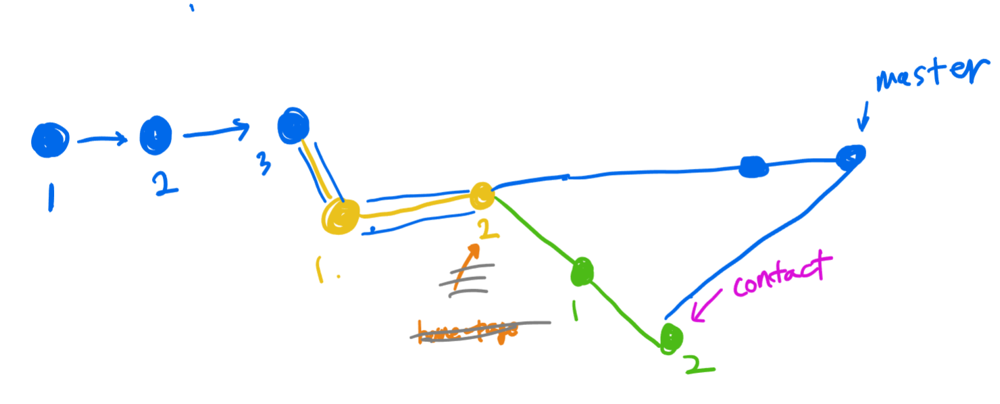
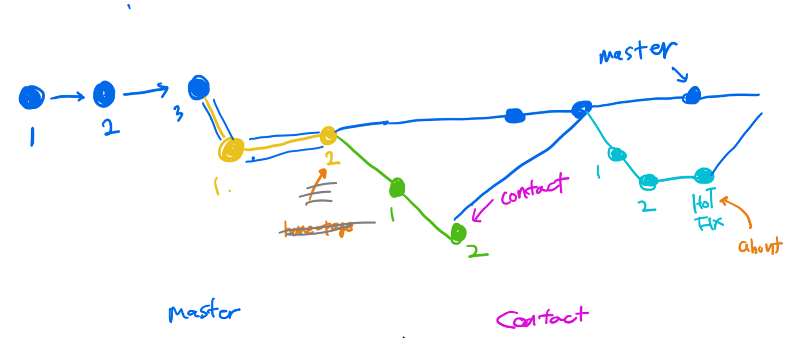
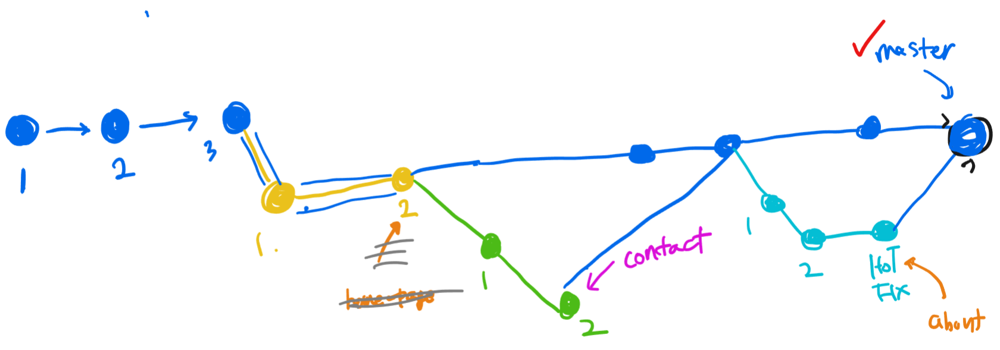
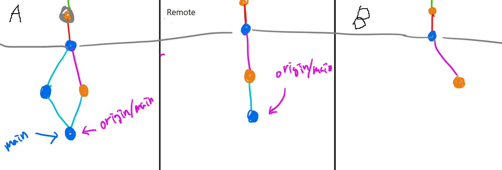

.git 폴더만 함께한다면 어디든 이사 가능 (남의 집안은 빼고)


git config~~~~~~~~~~~~


git init

git README.md

git .gitignore


git add .

git commit -m '코멘트'


깃헙사이트의 새로운 프로젝트와 연결

 ex)

```
git remote add origin https://github.com/landformdev/TIL.git
```


git push origin master




git log

git reflog : 상세로그


git status


stage에서 다시 내리고 싶으면

git restore --staged 경로


git reset

일반 : 분장실로 돌려보냄 but 화장은 그대로

--soft : 무대로 돌려보냄 

--hard : 타임머신 (절대 복구 못함) 

위험함! 올려보낸 드라이브에는 남아있는데 내가 가진건 없어서 생기는 괴리감 발생가능


가지를 하나 만듬

git branch 이름


git branch : 가지 현황 체크


git switch 이름 :  master에서 이름 가지로 이동    (예전엔 checkout)

(HEAD -> home-page, master) : HEAD가 나의 위치

(HEAD -> master, home-page) : HEAD가 나의 위치


master에서 변경사항 합침!

git merge 가지이름

Fast forward :  가지가 간 길 따라 감


병합한 branch는 삭제 권장

git branch -d 가지이름

git branch -D 가지이름 : 강제 삭제


생성 전환 작업 전환 병합


git switch -c 가지이름 : 생성과 동시에 이동




Fast-forward는 불가능한 상황



알아서 커밋해서 하나 만들어줌 (Auto merge) 딱 맞아 떨어지는 상황( 잘나오지 않음)




합치는 과정에서 겹쳐지는 것들이 발생하면 conflict 에러 발생

<<<<<<<<<<  ========== 같은 기호들 나오면 수작업으로 지워주면서 정리 (VScode는 정리 좀 도와줌)

정리 후 저장하고 다시 add,  commit -m 'merge conflict 해결'



git branch -d 가지이름


git push origin master 하면 branch 는 빼고 master만 올라감

다른것도 올리고 싶다면 git push origin 가지이름


듀얼리모트하기

git remote add **github** https://github.com/landformdev/learn_git.git

git push github master

자기가 알아서 지정 가능!


git remote 협업하기

| A                                                            | B                    |
| ------------------------------------------------------------ | -------------------- |
| README, ignore(python..등등) 체크 가능                       |                      |
| commit 이 찍히고 branch는 main이 기본                        |                      |
| ...(setting)에 가서 manage access에서 collaborator추가 -> B에게 메일로 초대가 옴 |                      |
| code에 https복사                                             | code에 https복사     |
| 수정 후                                                      | 수정 후              |
| add commit 하고                                              | add commit 하고      |
| git push origin main                                         | git push origin main |
| git pull 로 받아옴                                           | git pull 로 받아옴   |


동시에 작성하고 add commit  할 경우 push 먼저한쪽으로 올라감 (B가 먼저함)

늦은쪽은 push가 안됨 (A)

pull먼저 해야함

merge하고 push (A가 주관적으로 함)    ======> 먼가 문제가 있지 않나?? branch가 필요!




