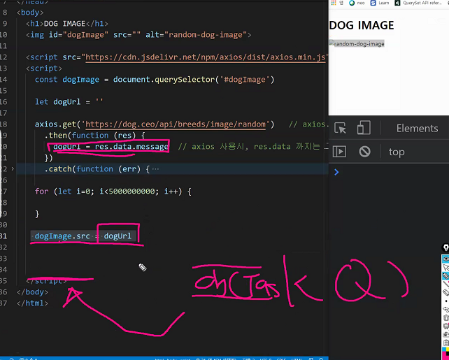

DOM 관련 : https://htmldom.dev/

trim() : 양쪽 여백을 지움

```
if () {

} else if {

} else {

}
```




일을 넘기는건 최 후순위이다.

중간에 for문을 넣어도 강아지 사진은 나오지 않음


# this

A **function's `this` keyword** behaves a little differently in JavaScript compared to other languages. It also has some differences between [strict mode](https://developer.mozilla.org/en-US/docs/Web/JavaScript/Reference/Strict_mode) and non-strict mode.

In most cases, the value of `this` is determined by how a function is called (runtime binding). It can't be set by assignment during execution, and it may be different each time the function is called. ES5 introduced the [`bind()`](https://developer.mozilla.org/en-US/docs/Web/JavaScript/Reference/Global_Objects/Function/bind) method to [set the value of a function's `this` regardless of how it's called](https://developer.mozilla.org/en-US/docs/Web/JavaScript/Reference/Operators/this#The_bind_method), and ES2015 introduced [arrow functions](https://developer.mozilla.org/en-US/docs/Web/JavaScript/Reference/Functions/Arrow_functions) which don't provide their own `this` binding (it retains the `this` value of the enclosing lexical context).