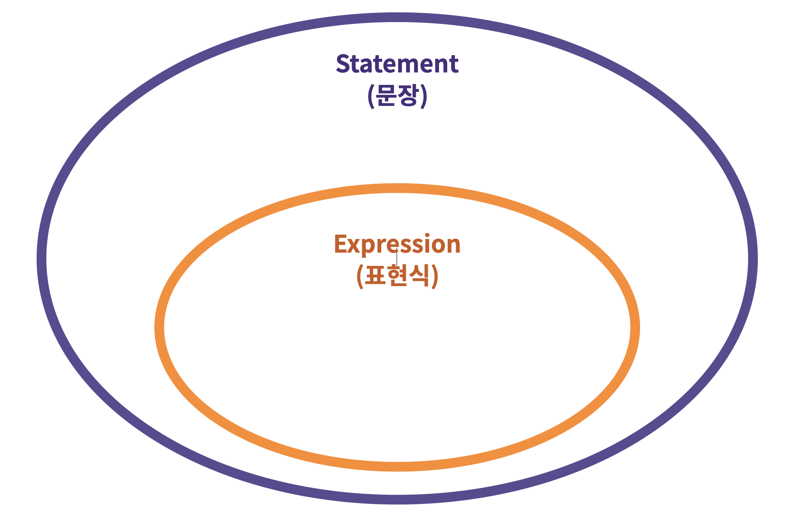
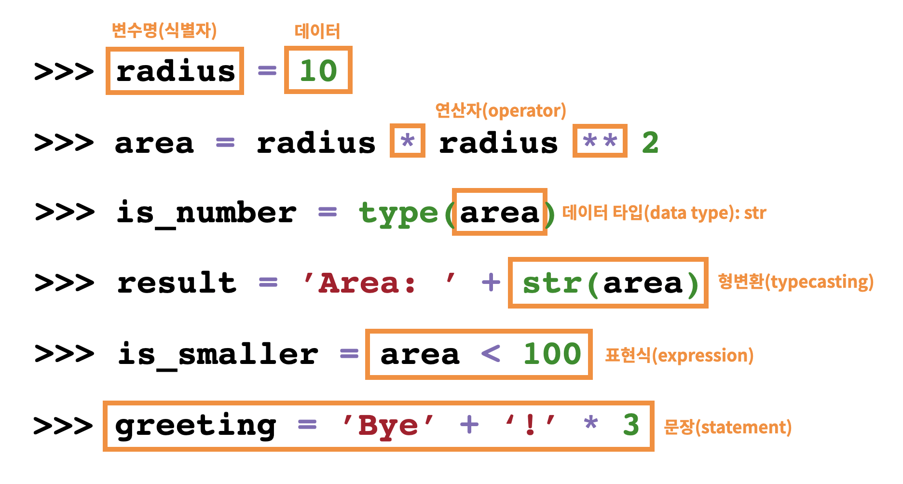

## 1. 기초 문법

### 주석

한 줄 주석처리  : #

여러줄 주석처리 :  """ or '''


### 코드라인

한 줄에 한 문장이 원칙

줄을 합칠때 ; 를 사용해서 합치는게 가능하긴 함 (비추)

```python
print('hello') ; print('everyone')
```

문자열을 여러줄 작성시 `\` 를 이용해서 나누는게 가능하긴 하나 *PEP-8* 국룰에 따르면 `"""` 을 주로 사용

```python
print('hello\
world')
```
```python
print("""hello
world""")
```

- `[]` `{}` `()`는 `\` 없이도 가능하다.

```python
lunch = [
    '짜장면', '짬뽕', '탕수육',
    '군만두', '물만두', '왕만두',
]
```


## 2. 변수

### 할당 연산자

`=`을 통해 할당한다.

`type()` : 데이터 타입 확인

`id()` : 값의 메모리 주소 확인

- 다른값을 동시 할당 가능

  ```python
  x, y, z = 1, 2, 3
  ```

**x, y만을 이용해 x와 y에 할당된 값을 서로 바꾸는 방법?**

```

```


### 식별자

파이썬에서 식별자는 변수, 함수, 모듈, 클래스 등을 식별하는데 사용되는 이름

- 대문자,  소문자,  _ ,  숫자로 구성

- 길이 제한 X

- 대소문자 구분, 첫 글자에 숫자 불가능

- 아래의 키워드는 사용 불가 (내장함수나 모듈의 이름으로도 만들면 안됨)

  ```python
  False, None, True, and, as, assert, async, await, break, class, continue, def, del, elif, else, except, finally, for, from, global, if, import, in, is, lambda, nonlocal, not, or, pass, raise, return, try, while, with, yield
  ```


## 3. 데이터 타입

### 숫자 타입

#### 정수 (integer)

모든 정수는 `int`로 표현

- n 진수 만들고 출력

  ```python
  binary_number = 0b10
  octal_number = 0o10
  decimal_number = 10
  hexadecimal_number = 0x10
  print(f"""
  2진수 : {binary_number}
  8진수 : {octal_number}
  10진수 : {decimal_number}
  16진수 : {hexadecimal_number}
  """)
  ```

  ```
  2진수 : 2
  8진수 : 8
  10진수 : 10
  16진수 : 16
  ```

#### 실수 (floating point number)

실수는 `float`로 표현

- 컴퓨터식 지수 표현방식

  e나 E 사용

  ```python
  pi = 314e-2
  ```

- 실수의 연산

  실수의 덧셈

  ```python
  3.5 + 3.2
  ```

  ```
  6.7
  ```

  실수의 뺄셈

  ``` python
  3.5 - 3.12
  ```

  ```
  0.3799999999999999 
  ```

  - `round()`를 통해 원하는 값으로 만들기 가능

  - 0~4는 내림 5는 동일하게 작동하지 않고 반올림 방식에 따라 다름 (짝수에서 5는 내림 / 홀수에서 5는 올림)

    ``` python 
    round(3.5 - 3.12, 2)
    ```

    ```
    0.38
    ```

  두개의 값이 같은지 확인

  ```python
  3.5 - 3.12 == 0.38
  ```

  ```
  false
  ```

  - 다양한 방법으로 처리가능

    ```python
    a = 3.5 - 3.12
    b = 0.38
    
    abs(a - b) <= 1e-10
    ```

    ```
    True
    ```

    ```python
    import sys
    abs(a - b) <= sys.float_info.epsilon
    ```

    ```
    True
    ```

    ```python
    import math
    math.isclose(a, b)
    ```

    ```
    True
    ```


#### 복소수 (complex number)

실수부와 허수부를 가짐 허수부는 `j`를 가짐

`.real` , `.imag` 을 통해 실수부와 허수부 추출 가능

- 문자열을 복소수로 면환 가능

  ```python
  complex('1+2j')
  ```

  ```
  (1+2j)
  ```

  중앙의 + - 주위에 공백을 넣으면 안됨

  ```python
  comoplex('1 + 2j')
  ```

  ```
  value Error
  ```


### 문자 타입 (String)

`'`나 `"`을 통해 표현 가능

문자열 안에 `'`나 `"`을 사용하고 싶을땐 앞에 `\`를 붙여 사용 or 서로 다른 문장부호를 사용

```python
print('철수가 말했다. "안녕?"')
print('철수가 말했다. \'안녕?\'') 
```

```
철수가 말했다. "안녕?"
철수가 말했다. '안녕?'
```

문자열 끼리 `+`를 통해 연결 가능

문자열에 `*`을 이용해 반복 가능

#### 이스케이프 시퀀스

문자열 안에 `\`를 이용하여 특수문자 혹은 조작 가능

| 예약문자 | 내용(의미) |
| -------- | ---------- |
| `\t`     | 탭         |
| `\n`     | 줄바꿈     |
| `\r`     | 캐리지리턴 |
| `\o`     | 널(Null)   |
| `\\`     | \          |
| `\'`     | '          |
| `\"`     | "          |

#### String interpolation

- % - formatting

  - %d : 정수
  - %f  : 실수
  - %s : 문자열
  
  ```python
  name = 'kim'
  score = 4.5
  print('Hello, %s' % name)
  print('내 성적은 %d' % score)
  print('내 성적은 %f' % score)
  ```
  
  ```
  Hello, Kim
  내 성적은 4
  내 성적은 4.500000
  ```
  
- str.format()

  ```python
  print('Hello, {}. 내 성적은 {}'.format(name, score))
  ```

  ```
  Hello, Kim. 내 성적은 4.5
  ```

- f - string : 파이썬 3.6 이후부터 지원

  ```python
  print(f'Hello, {name}. 내 성적은 {score}. {score}!')
  ```

  ```
  Hello, Kim. 내 성적은 4.5. 4.5!
  ```

  연산과 출력형식 지정 가능

  ```python
  import datetime
  today = datetime.datetime.now()
  print(f'오늘은 {today:%y}년 {today:%m}월 {today:%d}일 {today:%A}')
  
  pi = 3.141592
  print(f'원주율은 {pi:.4}! 반지름이 2일때 원의 넓이는 {pi*2*2}')
  ```

  ```
  오늘은 21년 01월 18일 Monday
  원주율은 3.142! 반지름이 2일때 원의 넓이는 12.566368
  ```

### 참/거짓(Boolean) 타입

`True`와 `False`로 이루어짐

비교/논리 연산에 사용

다음은 `False`로 변환됨 : `0, 0.0, (), [], {}, '', "", None`

### None 타입

값이 없음을 표현할 때 사용

### 형변환 (Type  conversion, Typecasting)

파이썬에서 데이터 타입은 서로 변환 가능

#### 암시적 형변환 (Implicit Type Conversion)

사용자가 의도하지 않아도 내부적으로 자동으로 형변환 하는 경우

- bool

  ```python
  True + 6  # True 가 1로 변환
  ```

  ```
  7
  ```

- Numbers (int, float, complex)

  int + float = float,  int + complex = complex

#### 명시적 형변환 (Explicit Type Conversion)

위의 상황을 제외하고는 모두 명시적으로 형 변환을 해주어야합니다.

- string -> intger : 형식에 맞는 숫자만 가능
- integer -> string : 모두 가능

암시적 형변환이 되는 모든 경우도 명시적으로 형변환이 가능합니다.

- `int()` : string, float를 int로 변환
- `float()` : string, int를 float로 변환
- `str()` : int, float, list, tuple, dictionary를 문자열로 변환


## 4. 연산자 (Operator)

- 산술 연산자
- 비교 연산자
- 논리 연산자
- 복합 연산자
- 기타 연산자

### 산술 연산자

| 연산자 | 내용           |
| ------ | -------------- |
| +      | 덧셈           |
| -      | 뺄셈           |
| *      | 곱셈           |
| /      | 나눗셈         |
| //     | 몫             |
| %      | 나머지(modulo) |
| **     | 거듭제곱       |

- 나눗셈은 항상 float를 돌려준다.
- 정수 나눗셈으로 정수 결과를 얻으려면 //를 사용하자

divmod는 몫과 나머지를 동시에 구할 수 있음

```python
quotient, remainder = divmod(5, 2)
print(f'몫은 {quotient}, 나머지는 {remainder}')
```

```
몫은 2, 나머지는 1
```


### 비교 연산자

| 연산자 | 내용                   |
| ------ | ---------------------- |
| <      | 미만                   |
| <=     | 이하                   |
| >      | 초과                   |
| >=     | 이상                   |
| ==     | 같음                   |
| !=     | 같지 않음              |
| is     | 객체 아이덴티티        |
| is not | 부정된 객체 아이덴티티 |

### 논리 연산자

| 연산자          | 내용                         |
| --------------- | ---------------------------- |
| A and B (=  & ) | A, B 둘다 True 일때만 True   |
| A or B (=  \| ) | A, B 둘다 False 일때만 False |
| not A           | True -> False, False -> True |

#### 단축평가

and 와 or에서 앞의 값이 확실할 시 뒤의 값은 보지않음

- `and` 는 둘 다 True일 경우만 True이기 때문에 첫번째 값이 True라도 두번째 값을 확인해야 하기 때문에 뒤의 값이 반환된다.
- `or` 는 하나만 True라도 True이기 때문에 True를 만나면 해당 값을 바로 반환한다.

### 복합 연산자

연산과 대입이 함께 이루어짐

| 연산자  | 내용       |
| :------ | :--------- |
| a += b  | a = a + b  |
| a -= b  | a = a - b  |
| a *= b  | a = a * b  |
| a /= b  | a = a / b  |
| a //= b | a = a // b |
| a %= b  | a = a % b  |
| a **= b | a = a ** b |

### 기타 연산자

- 숫자가 아닌 자료형은 `+` 연산자를 통해 연결 가능 ex) 문자열, 리스트...
- `in` 연산자를 통해 요소가 속해있는 여부 판단 가능 ex) 문자열, 리스트, range ....
- `is`연산자를 통해 동일한 object인지 판단 가능
- `[]`를 통해 인덱스 접근 가능, `[:]`를 통해 슬라이싱 가능

### 연산자 우선순위

1. `()`을 통한 grouping
2. Slicing
3. Indexing
4. 제곱연산자 `**`
5. 단항연산자 `+`, `-` (음수/양수 부호)
6. 산술연산자 `*`, `/`, `%`
7. 산술연산자 `+`, `-`
8. 비교연산자, `in`, `is`
9. `not`
10. `and`
11. `or`

### 표현식과 문장의 차이

표현식 : 하나의 값으로 환원될 수 있는 문장

문장 : 파이썬이 실행 가능한 최소한의 코드 단위




## 5. 변수와 자료형 정리

