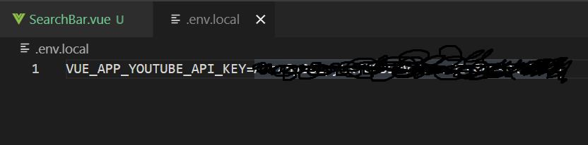
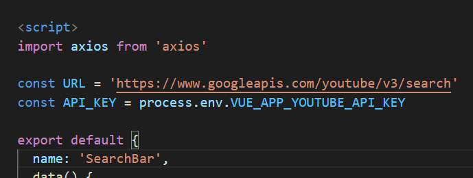
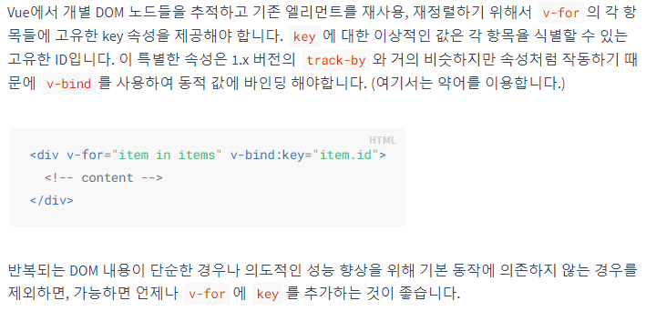
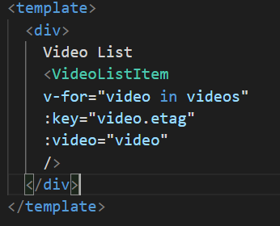
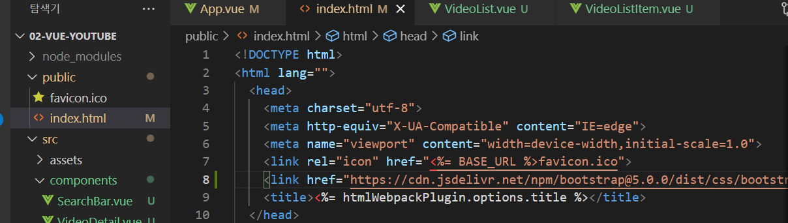
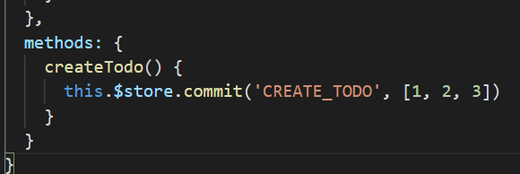

\

api key 숨길때 .env.local에 만드는데 반드시 VUE_APP_로 시작해야함

- 중요한 api키는 깃헙에 올리기전에 꼭 숨길것 도용가능성이 있음

이벤트명은 케밥케이스 사용하자

- v-for의 우선순위가 항상 가장 높아서 :video="video" 가능

- CDN쓸꺼면 여기 넣기

npm run build로 내보내기 가능 dist 폴더안에 들어감

commit으로 넘길때 첫번째 이름 말고 두개이상 넘기려면 배열사용