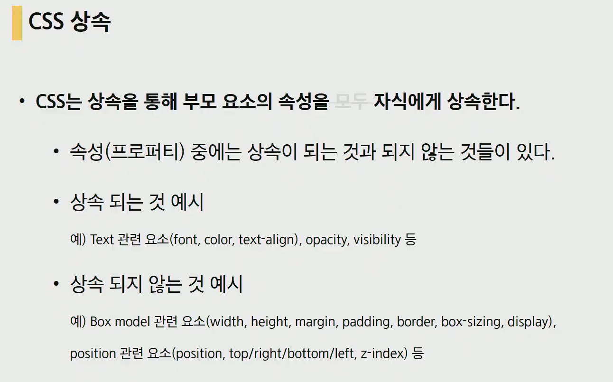
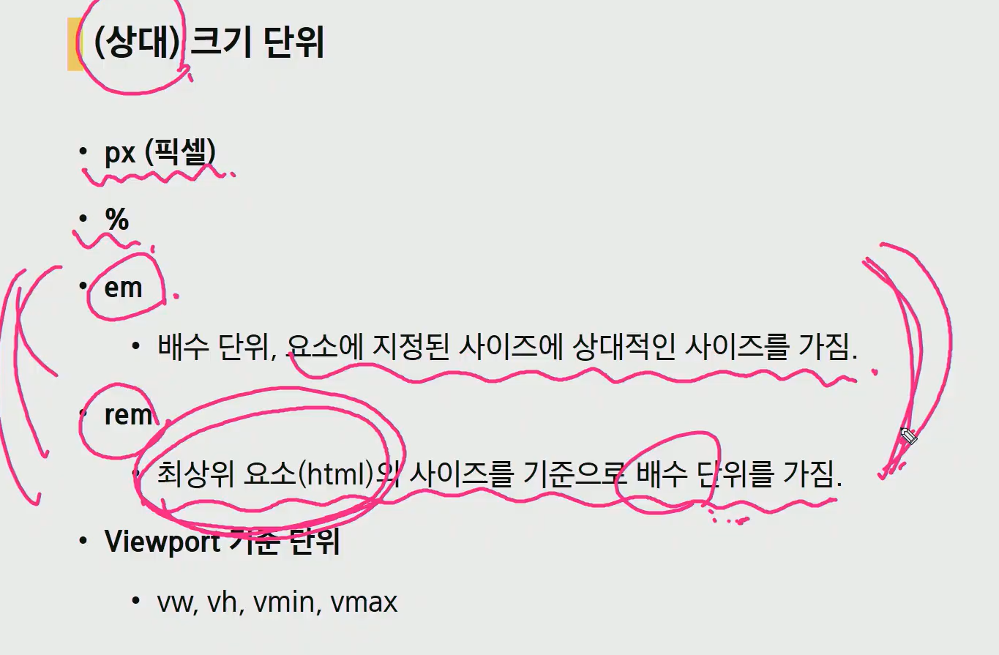
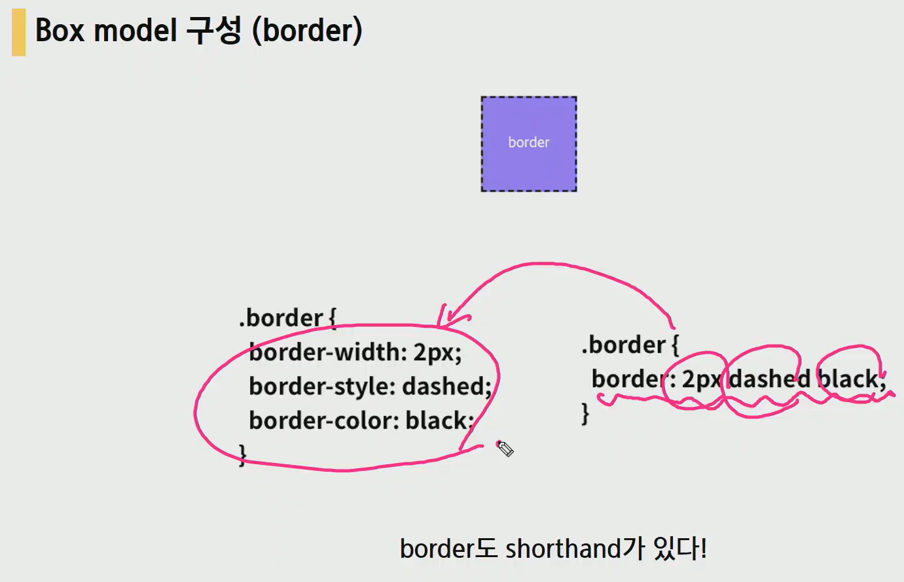

# 210201 CSS 시작


html과 CSS는 각각의 언어를 가진 별개의 언어이다. but CSS는 html없인 사용 불가


정의방법

1. 인라인 : 해당 태그에 style 속성을 이용
2. 내부참조 : <head>내에 <style>에 지정
3. 외부참조 - 분리된 CSS파일 : 외부 CSS파일을 <head>내에 <link>를 통해 연결


 lorem  +Tab : 아무문장 생성


class 선택자


!important 는 정말 특수한 경우가 아니면 사용하지 않음

class선택자 위주로 작성하는 것이 편하다.

소스 순서는 늦게 작성된게 덮어 씌운다.







html기본 사이즈는 16px

em은 계속 상속받아 예상외의 크기가 되기도함

rem이 편하다. but 이것만 쓰는건 아님


## BOX model


Margin : 상하좌우


margin: 0 auto;  :  /* 가운데 정렬 */


Border : 상하좌우




Padding : 상하좌우


border와 padding까지 고려해서 width를 정해야함


일반적으로 시작시  border-box를 선언하고 시작하는 경우가 많음

```
    * {
      box-sizing: border-box;
    }
```


마진상쇄

블럭요소의 top bottom에서 발생


block은 기본 너비의 100%

inline은 컨텐츠 영역만큼 만


none을 쓰면 공간이 사라져 밑에 것이 위로 올라가서 망칠수 있다.


## ===================================================================


