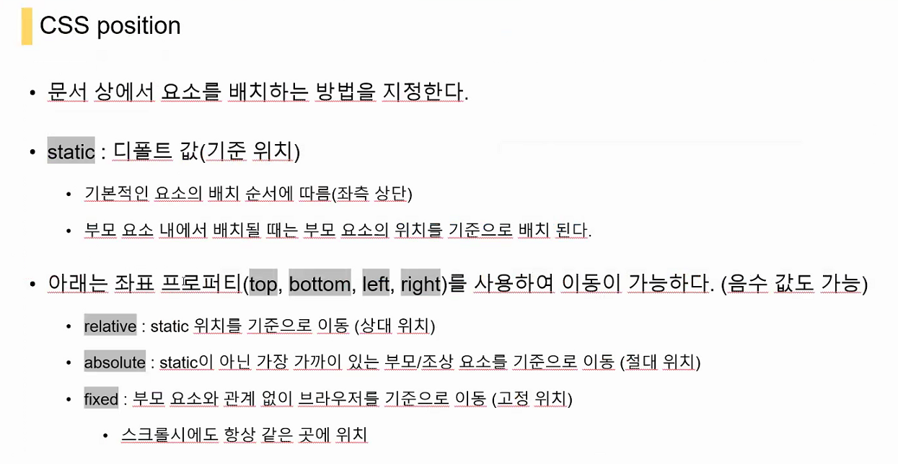

# 210202 CSS position


```html
<!DOCTYPE html>
<html lang="en">
<head>
  <meta charset="UTF-8">
  <meta name="viewport" content="width=device-width, initial-scale=1.0">
  <title>Document</title>
  <style>
    div {
      /* div(box) styling */
      height: 100px;
      width: 100px;
      background-color: purple;
      /* margin : 0 auto; 중앙 정렬*/
      /* content(text) styling */
      color: white;
      line-height: 100px;
      text-align: center;
    }
    /* reletive는 원래 static일 경우에 있어야 할 자리 기준으로 움직인다 */
    .reletive {
      position: relative;
      top: 100px;
      left: 100px;
    }
  </style>
</head>
<body>
  <div>static</div>
  <div class="reletive">relative</div>
</body>
</html>
```

```html
<!DOCTYPE html>
<html lang="en">
<head>
  <meta charset="UTF-8">
  <meta name="viewport" content="width=device-width, initial-scale=1.0">
  <title>Document</title>
  <style>
    div {
      /* div(box) styling */
      height: 100px;
      width: 100px;
      background-color: purple;
      /* content(text) styling */
      color: white;
      line-height: 100px;
      text-align: center;
    }
    .parent {
      position: static;
      margin: 0 auto;
    }
    .parent_special {
      position: relative;
      margin-left: 200px;
    }
    .child {
      /* 특별한(static이 아닌)부모 요소가 없으면 body기준으로 움직인다. */
      /* 특별한 부모 요소가 있으면 가장 인접한 특별한 부모기준으로 움직임*/
      position: absolute;
      top: 50px;
      left: 50px;
    }
    .child2 {
      position: absolute;
      top: 50px;
      left: 50px;
    }
    .fixed {
      position: fixed;
      bottom: 0;
      width: 100%;
    }
  </style>
</head>

<body>
  <div class="parent">
    부모(static)
    <div class="child">
      자식 (absolute)
    </div>
  </div>

  <div class="parent_special">
    특부모(relative)
    <div class="child2">
      자식2 (absolute)
    </div>
  </div>

  <div class="fixed">fixed</div>
</body>
</html>
```

static은 top, left, right, bottom 불가

reletive는 원래 static일 경우에 있어야 할 자리 기준으로 움직인다.

fixed는 스크롤이 움직여도 항상 같은곳


```html
<!DOCTYPE html>
<html lang="en">
<head>
  <meta charset="UTF-8">
  <meta name="viewport" content="width=device-width, initial-scale=1.0">
  <title>Document</title>
  <style>
    div {
      /* div(box) styling */
      height: 100px;
      width: 100px;
      background-color: purple;
      /* margin : 0 auto; */
      /* content(text) styling */
      color: white;
      line-height: 100px;
      text-align: center;
    }

    .parent {
      position: relative;
      width: 300px;
      height: 300px;
    }
    .abs {
      position: absolute;
      top: 100px;
      background-color: crimson;
    }
    .rel {
      position: relative;
      top: 100px;
      background-color: tomato;
    }
    .sibling {
      width: 200px;
      height: 100px;
      background-color: deepskyblue;
    }
  </style>
</head>

<body>
  <!-- div.parent>div.abs+div.sibling -->
  <div class="parent">
    <div class="abs">abs형</div>
    <div class="sibling">남동생</div>
  </div>
  <hr>
  <div class="parent">
    <div class="rel">rel언니</div>
    <div class="sibling">여동생</div>
  </div>

</body>
</html>
```

absolute는 자기 자기를 비워주고 움직임 (좀더 앞에 나와았는 느낌)

reletive는 자기 원래자리 자치한 상태에서 움직임





클래스 이름은 _ 대신 - 가 국룰

클래스 이름엔 외형보단 역할을 명시하자