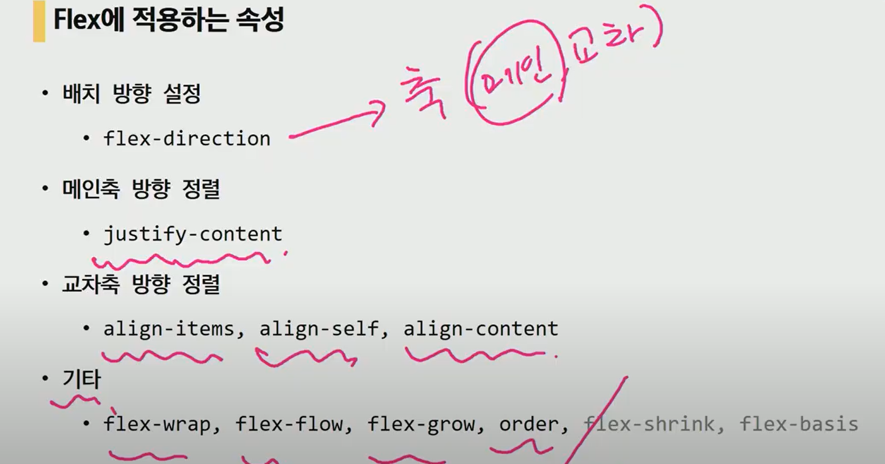
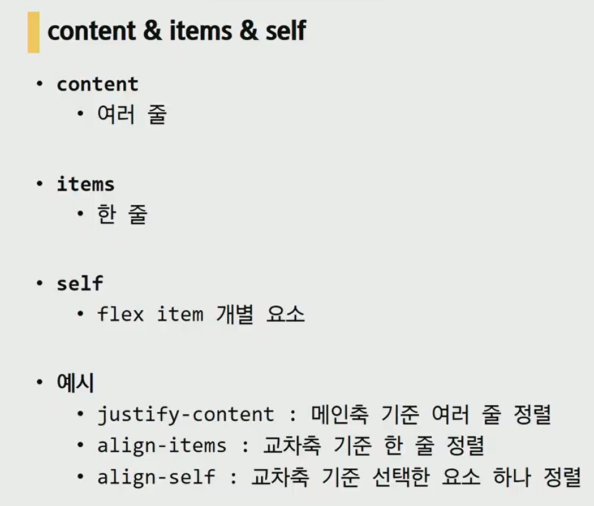
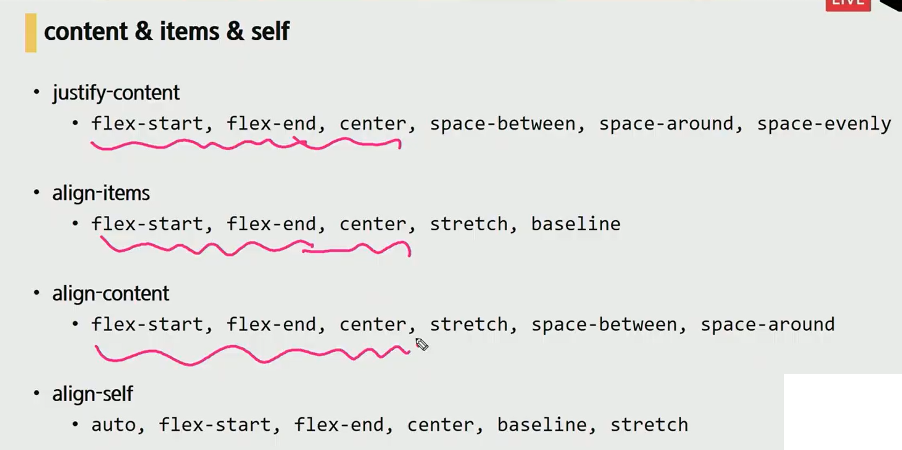

flex container를 제어해서 안에 flex item을 배치

기본 방향은 x축 양의 방향 (오른쪽 방향)(main축)

display에 flex or inline-flex를 선언 (정렬할 것의 부모 클래스에 )

justify는 content만

align은 경우에 따라 items, content 선택

tiems는 묶어서 하나로

content는 줄로 묶어서 