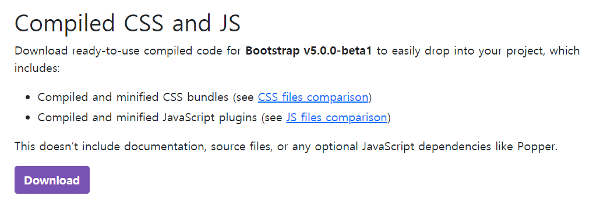
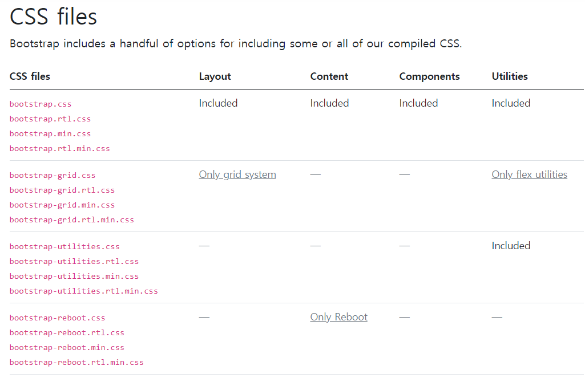
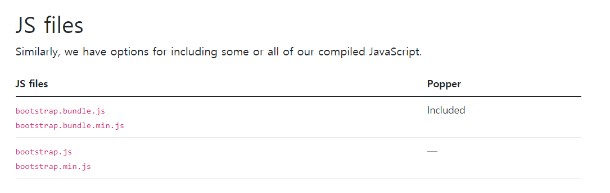
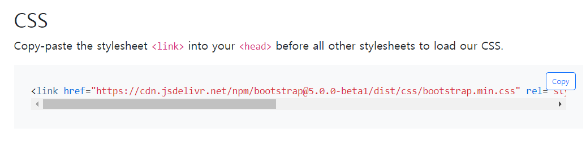
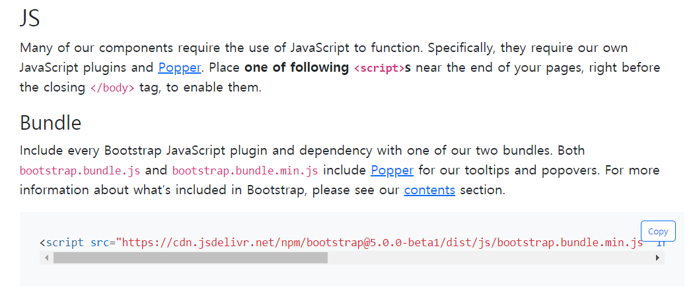
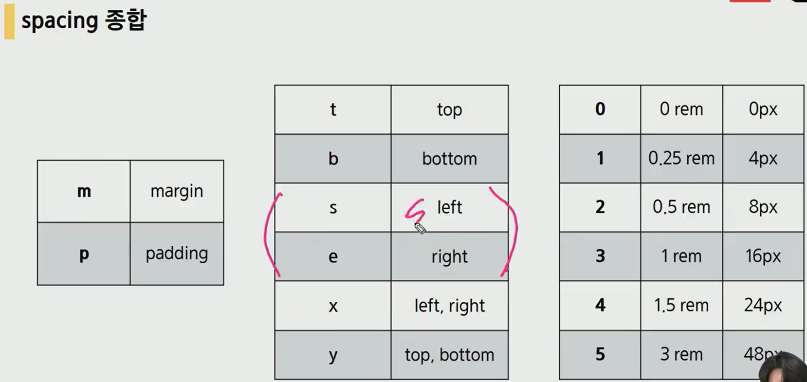
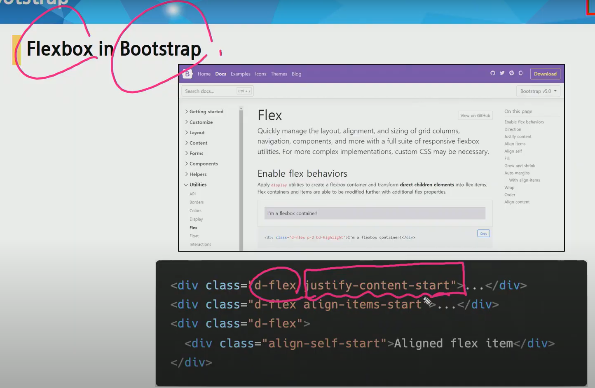
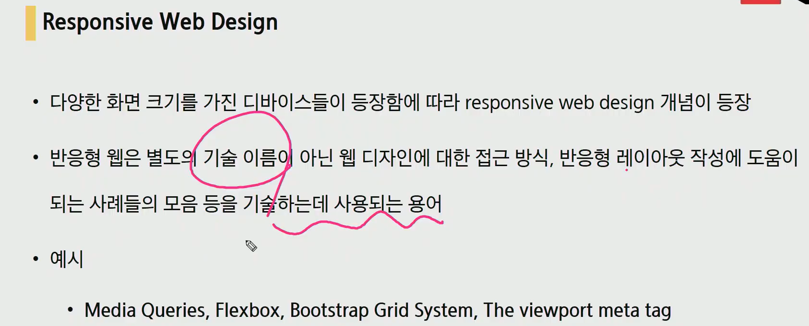
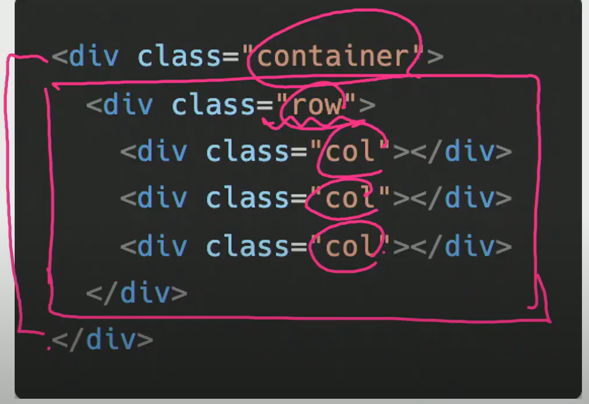

반응형 웹 제작을 도와주는 사이트

https://getbootstrap.com/

우즉 상단 download에서 



다운

.min.파일은 한줄로 나타낸것 (속도를 단축하기 위해서 사용)

.map.은 브라우저가 디버깅할때 사용 우리는 사용하지 않음




우리가 사용할건 다 가지고 있은 bootstrap.css



이것도 다 가지고 있는 bootstrap.bundle.js

```html
적용방법

<head>
    <link rel="stylesheet" href="bootstrap.css">
</head>

<body>
    <script src="bootstrap.bundle.js"></script>
</body>
```


bootstrap-reboot.css파일은 최대한 속성이 없는 상태로 초기화 시켜주는 코드


초기화 방법은 reset과 normalize가 있는데 최근에는 normalize 선호


CDN

컨텐츠를 효율적으로 전달하기 위해 여러 노드에 가진 네트워크에 데이터를 제공하는 시스템

외부서버를 사용함으로써 본인 서버의 부하가 적어짐






주소를 복사해서 사용가능 (다운 보다는 앞으로 이 방법으로 사용하자)










greed system



12개의 col 사용 (약수가 많아서 => 레이아웃을 다양하게 짤 수 있다.)

6개의 breakpoint

내부적으로 flexbox를 이용해 돌아간다.


ctrl + alt + 방향키 위 아래 : 멀티 커서


`<p></p>`는 문단이라 밑에 마진 들어가 있음

container : 양옆을 어느정도 비워줌

column안에 또 row 만들기 가능

img-fluid : 이미지 비율 자동 조정

gutter는 row에 줘서 column사이의 간격을 조정하는 것 (column에 줘서 따로 조정도 가능)